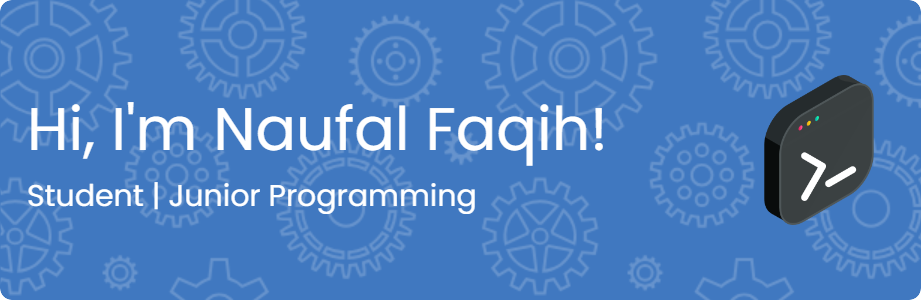

# 👋 Hi, I'm Naufal Faqih!

🚀 I'm a passionate developer with a strong interest in C++, software architecture, and solving real-world problems with clean, efficient code.

🏫 I am a student at Universitas Pembangunan Nasional "Veteran" Yogyakarta with a study program in informatics

🛠️ Currently working on projects in networking, healthcare systems, and data processing.

📚 Always learning — especially in areas like algorithms, backend development, and system optimization.

💡Interests: AI, Software engineering, cloud computing system, machine learning

🌱 Current Focus
Building a Hospital Management System in C++ to streamline patient data workflows and treatment tracking.

🔧 Tech Stack
**Languages:** 

**Tools:**

**My Github Stats**

**📫 Let's Connect!**
   
✉️ bangpeqih17@gmail.com

"Code is like humor. When you have to explain it, it’s bad." – Cory House

**Play games with me**

###

<picture>
  <source media="(prefers-color-scheme: dark)" srcset="https://raw.githubusercontent.com/Naufalfaqih1320/Naufalfaqih1320/output/pacman-contribution-graph-dark.svg">
  <source media="(prefers-color-scheme: light)" srcset="https://raw.githubusercontent.com/Naufalfaqih1320/Naufalfaqih1320/output/pacman-contribution-graph.svg">
  
</picture>

###